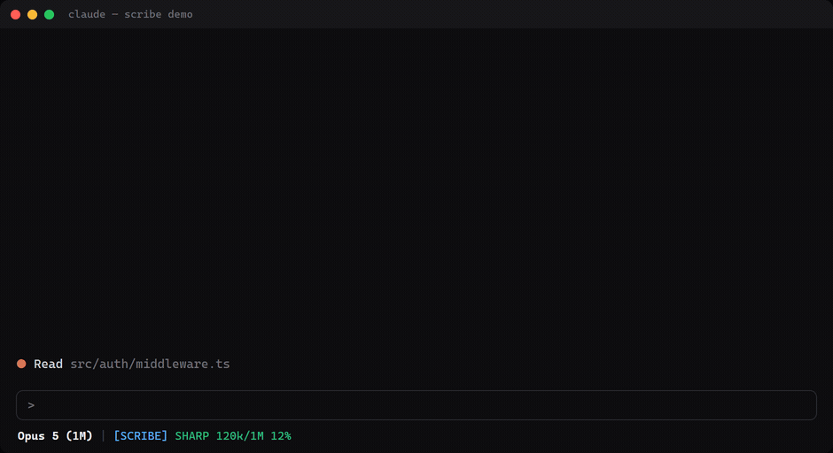

<p align="center">
  <picture>
    <source media="(prefers-color-scheme: dark)" srcset="assets/scribe-logo-dark.png">
    
  </picture>
</p>

<p align="center"><b>Context-rot monitor + auto handoff for Claude Code</b></p>

A statusline segment that shows how full your context window is, graded into a
reasoning-quality state, plus a hook that auto-writes a session handoff the moment
you cross the danger line.



The meter fills as the session grows, grades itself, and at 90% the handoff writes itself.


## The problem

Long Claude Code sessions get worse, not better. As the context window fills, the model
starts missing things it knew 200 messages ago, repeats work, and re-litigates settled
decisions. This is context rot, and it is invisible: the session looks identical at 20%
and at 92%.

Two failure modes follow:

1. You keep working in a degraded session because nothing tells you to stop.
2. You finally start a fresh session and lose everything — the decisions, the dead ends,
   the half-finished task, the traps you hit at hour two.

SCRIBE fixes both: it makes the fill level visible at all times, and at 90% it writes the
handoff for you, while the current instance still remembers the session.

## What it does

**1. Statusline meter.** Every render, it reads the tail of your session transcript, sums
`input_tokens + cache_read_input_tokens + cache_creation_input_tokens` (that sum IS the
current context size), and divides by the window. Window is auto-detected: 1M if the model
id contains `1m` or usage is already over 200k, else 200k.

State thresholds:

| State  | Context | Meaning |
|--------|---------|---------|
| SHARP  | < 50%   | Full quality |
| OK     | 50–74%  | Fine, start being deliberate |
| FADING | 75–89%  | Quality slipping, wrap up the current thread |
| DUMB   | 90%+    | Hand off now |

At DUMB the meter appends a blinking `! HANDOFF -> NEW INSTANCE`. The blink is ANSI
SGR 5 — terminals that ignore it (VS Code's integrated terminal, iTerm2 by default)
show it bold red instead.

**2. Auto handoff at 90%.** A hook fires on every prompt and every tool call. When context
crosses 90% for the first time in a session, it:

- archives any previous handoff to `_handoff/archive/`
- writes `_handoff/CURRENT.md` — a skeleton pre-filled with your requests this session,
  every file edited, every file read, plus empty `State` / `Decisions` / `Next steps` /
  `Gotchas` sections
- writes `_handoff/handoff-graph.json` — session, request, and file nodes with
  `MADE_REQUEST` / `EDITED` / `READ` edges
- injects an instruction telling Claude to fill in the skeleton, enrich the graph, and
  print a ready-to-paste **continuation prompt** to `_handoff/CONTINUATION.md`

Then you open a fresh session, paste the continuation prompt, and the new instance reads
`CURRENT.md` before touching anything. Nothing is lost.

It fires **once per session** (marker file in `~/.claude/.scribe-dumb-fired/`), so it does
not nag every prompt after 90%. Markers older than 7 days self-prune.

## Why a hook and not a memory or a prompt rule

The model cannot see its own token count. Only the harness can. A hook runs outside the
model, reads the real transcript, and injects the alert as context — so the trigger is
mechanical and fires exactly when it should, not when the model happens to notice.

## Install

Requires Python 3.8+ (any OS — Windows, macOS, Linux).

```bash
git clone <this-repo> scribe-statusline
cd scribe-statusline
python install.py
```

The installer:
- copies `scribe_dumb_trigger.py` to `~/.claude/hooks/`
- copies `statusline_scribe.py` to `~/.claude/`
- backs up `~/.claude/settings.json` to `settings.json.bak-<timestamp>`
- registers the hook on `UserPromptSubmit` and `PostToolUse`
- sets `statusLine` **only if you don't already have one** — if you do, it prints the
  snippet for you to merge yourself

Restart Claude Code afterwards.

## Use

- **Turn off:** delete `~/.claude/.scribe-active`. Statusline shows `[SCRIBE off]`, hook
  exits immediately.
- **Turn on:** recreate that file (any content).
- **Reading the meter:** treat FADING as "finish the current thing, don't start a new
  one". Treat DUMB as "stop, hand off".
- **At DUMB:** let Claude finish the handoff, copy the continuation prompt it prints,
  open a fresh session, paste.

## Configure

| Env var | Default | What |
|---------|---------|------|
| `SCRIBE_HANDOFF_DIR` | `~/.claude/_handoff` | Where handoff files land. Point it at a project or knowledge-base folder to keep handoffs with the work. |
| `SCRIBE_DUMB_PCT` | `90` | Trigger threshold. Set both for the hook and the statusline. |

## Merge into an existing statusline

SCRIBE prints one segment. To combine it with your own statusline, call it from your
script and append the output, or copy `rot_state()` + `last_usage()` out of
`statusline_scribe.py` — they are the whole trick, about 30 lines.

## Uninstall

1. Restore `~/.claude/settings.json` from the `.bak-<timestamp>` file the installer made.
2. Delete `~/.claude/hooks/scribe_dumb_trigger.py`, `~/.claude/statusline_scribe.py`,
   `~/.claude/.scribe-active`, `~/.claude/.scribe-dumb-fired/`.

## Files

| File | Role |
|------|------|
| `statusline_scribe.py` | The meter. Reads statusline JSON on stdin, prints one colored segment. |
| `scribe_dumb_trigger.py` | The hook. Detects 90%, writes handoff + graph, injects instruction. |
| `install.py` | Copies files, merges settings with a backup. |
| `demo/terminal.html`, `demo/states.html` | The demo terminals in the GIFs above — plain HTML, no build. |
| `demo/capture.mjs` | Renders those pages to GIF + MP4 (headless Chromium + ffmpeg). |
| `demo/scribe-demo.mp4` | Same demo as 1880x1024 H.264, 30fps — for slides and socials. |

## Re-render the demo

Needs Node 18+, ffmpeg, and a Playwright Chromium build.

```bash
cd demo
npm install
node capture.mjs
```

Captures at 30fps, then writes an MP4 at full rate and a GIF downsampled to 12fps.

Edit the `SCENE` array in `demo/terminal.html` to change what the terminal says.
